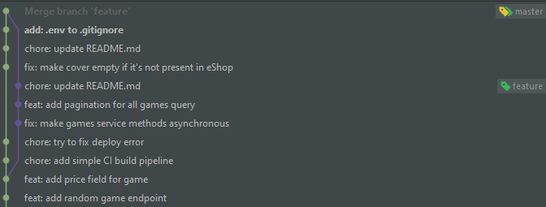

### 1 task


cd .git
nano DESCRIPTION aboba


### 2 task
```
git cherry -v master 
git rebase -i HEAD~2
git rebase master
git merge ci
git branch -d ci
```


### 3 task
```
git log --reflog
git branch old-master 18eabfefb2ba8d1f5a87817ac36edb3b86e1335c
```


### 4 task
```
git blame prisma/seed.ts
```


### 5 task
```
git bisect start
npm run test
git bisect good/bad
```


### 6 task
```
git filter-branch --index-filter 'git rm --cached .env --ignore-unmatch' --prune-empty --tag-name-filter cat -- --all
```


### 7 task
```
git filter-branch --commit-filter '
    if [ "$GIT_AUTHOR_EMAIL" = "bakasaru@list.ru" ];
    then
            GIT_AUTHOR_NAME="AnnemariaRe";
            GIT_AUTHOR_EMAIL="annemariarepenko@gmail.com";
            git commit-tree "$@";
    else
            git commit-tree "$@";
    fi' HEAD
```


### 8 task
```
git config --global rerere.enabled true
git rerere diff
git merge feature
```


### 9 task
```
git fsck --lost-found
```


### 10 task
```
git gc
```


### 11 task
```
git commit -m "message"
```